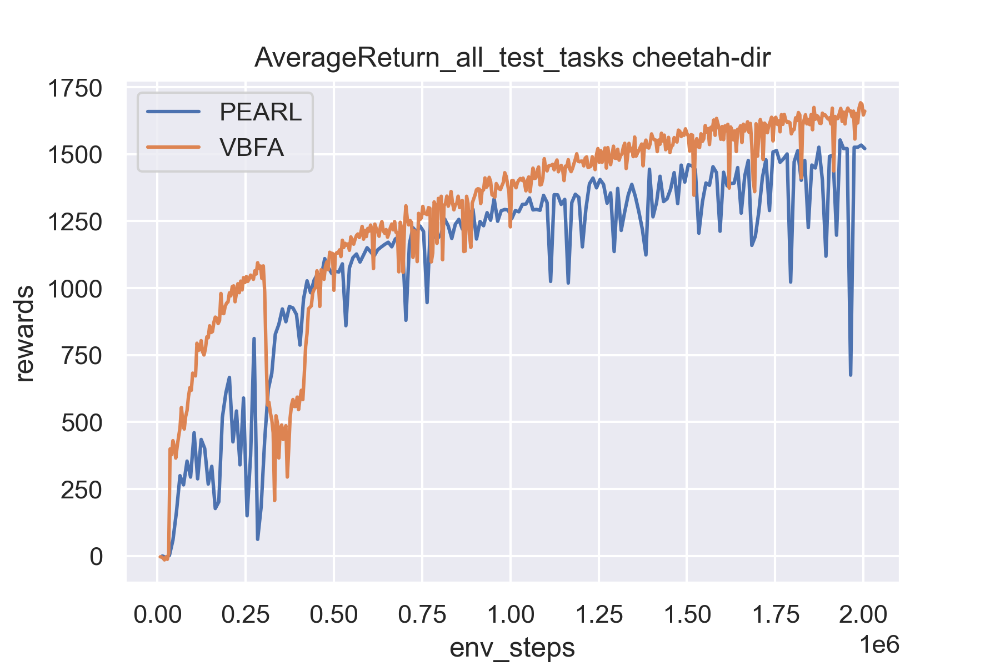
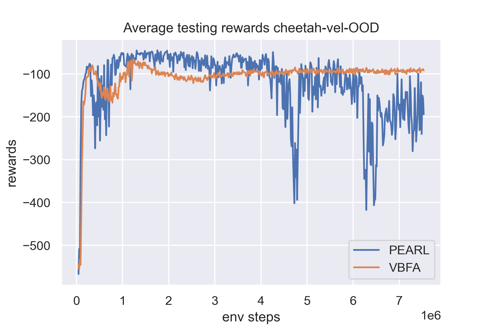
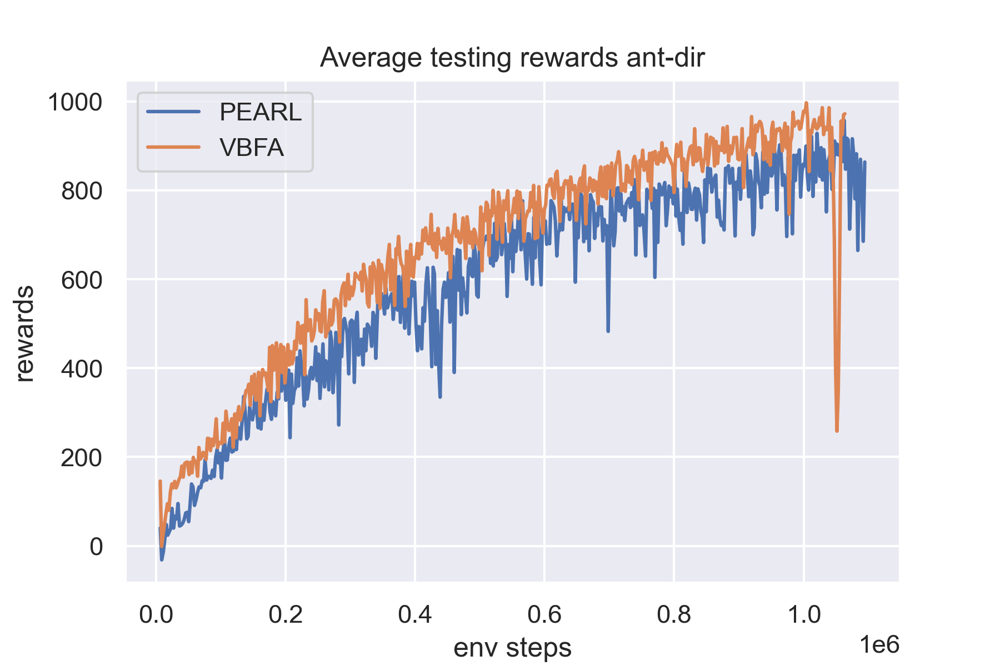
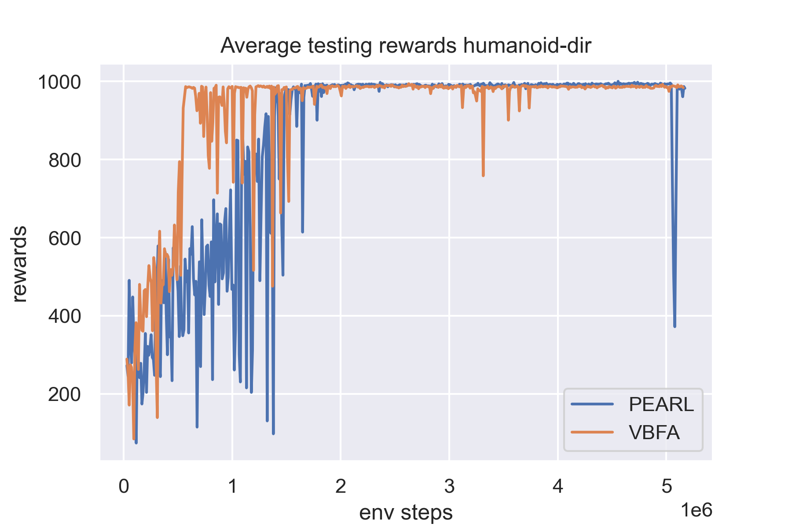

# CRL

To install locally, you will need to first install mujoco200, mujoco131.

This installation has been tested only on 64-bit Ubuntu 16.04.

To reproduce an experiment, run:
`python launch_experiment.py ./configs/[EXP].json`

Our codes are built on PEARL: https://github.com/katerakelly/oyster

## Results:
**Half-Cheetah-Fwd-Back**

**Half-Cheetah-Vel**

**Ant-Fwd-Back**

**Humanoid-Direc-2D**

